# Продажа автомобилей - Cars.

## Общее описание:
Web приложение для продажи машин.

***

## Реализовано:
* Регистрация\авторизация
* Добавление\редактирование объявлений (фото, категории машины, марка, тип кузова и тд.)
* Покупка автомобиля

***

## Технологии:

***

## Запуск проекта:
* создать базу данных `cars`
* `maven install`
* `java -jar target/job4j_cars-1.0-SNAPSHOT.jar`

***

## Структура сайта:

### 1. Главная страница.

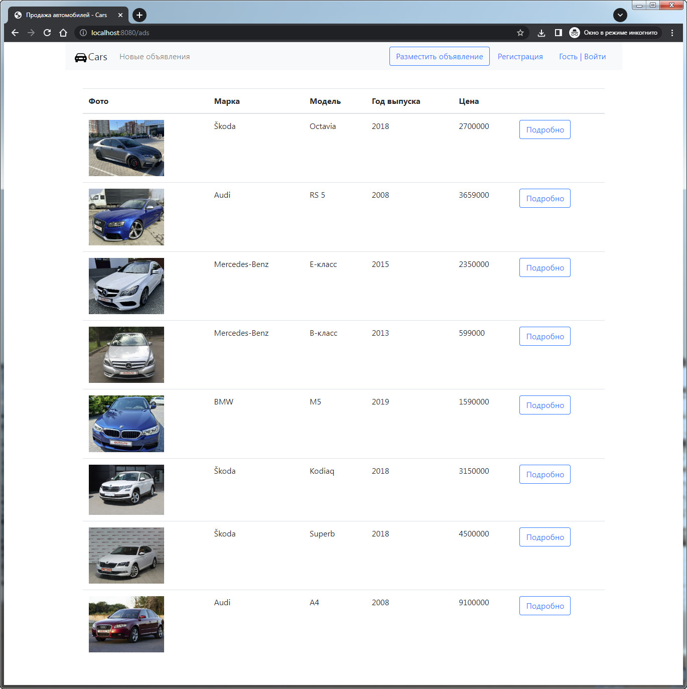

### 2. Новые объявления добавленные за последние сутки.

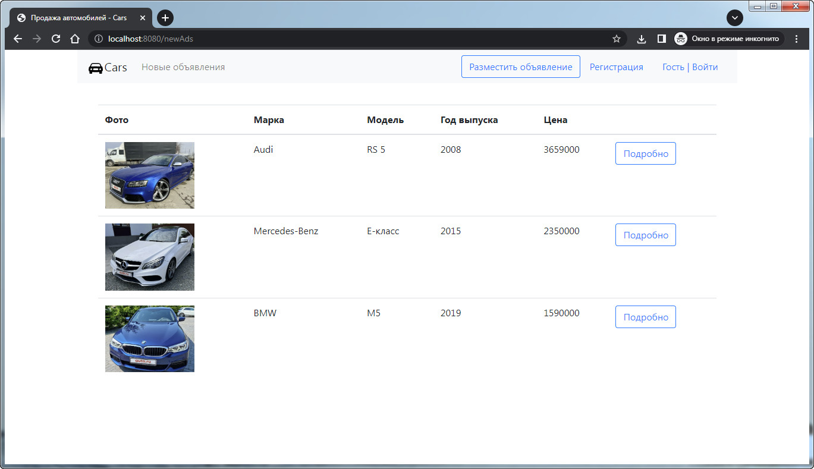

### 3. Регистрация нового пользователя.

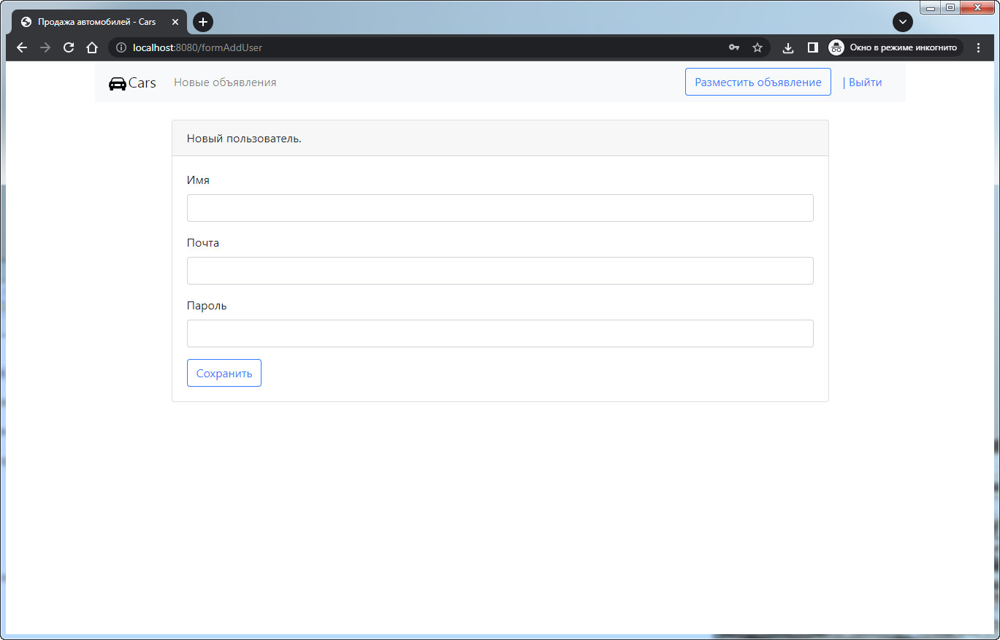

### 4. Авторизация.

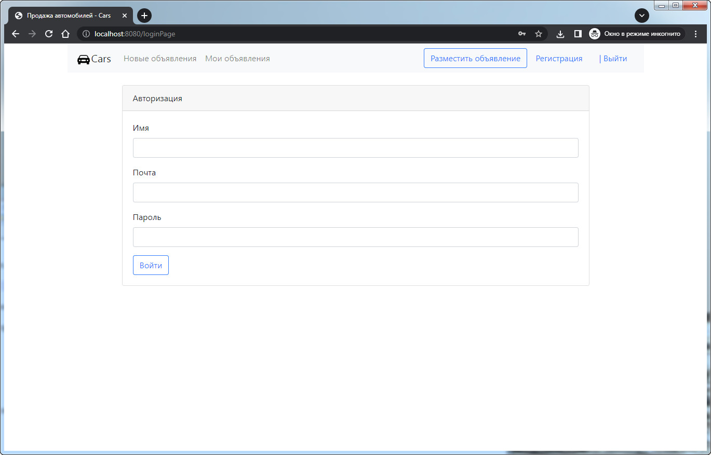

### 5. Объявления добавленные пользователем.

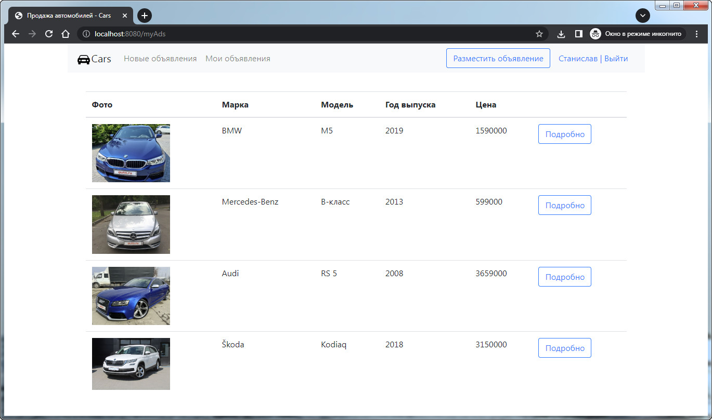

### 6. Добавление нового объявления.

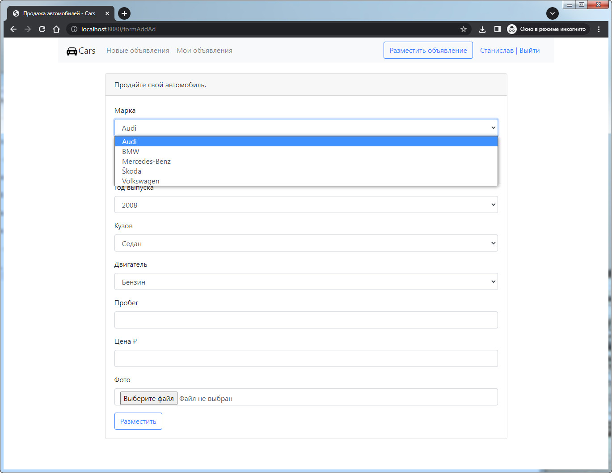

### 7. Подробное описание с возможностью покупки.

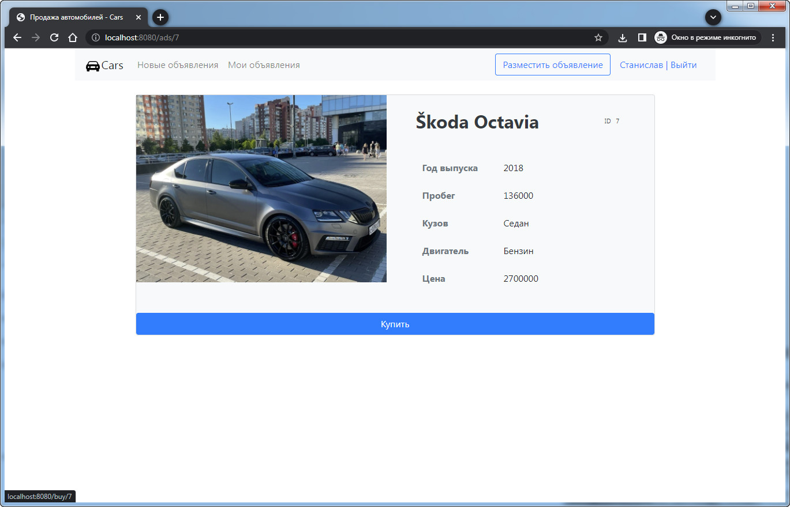

### 8. После покупки статус меняется.

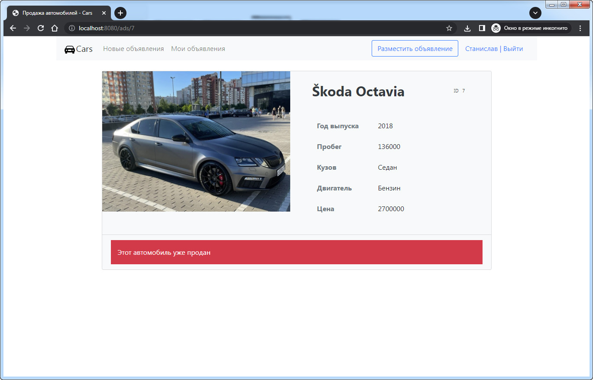

### 9. Просмотр своего объявления с возможностью редактирования, удаления и смены статуса продажи.

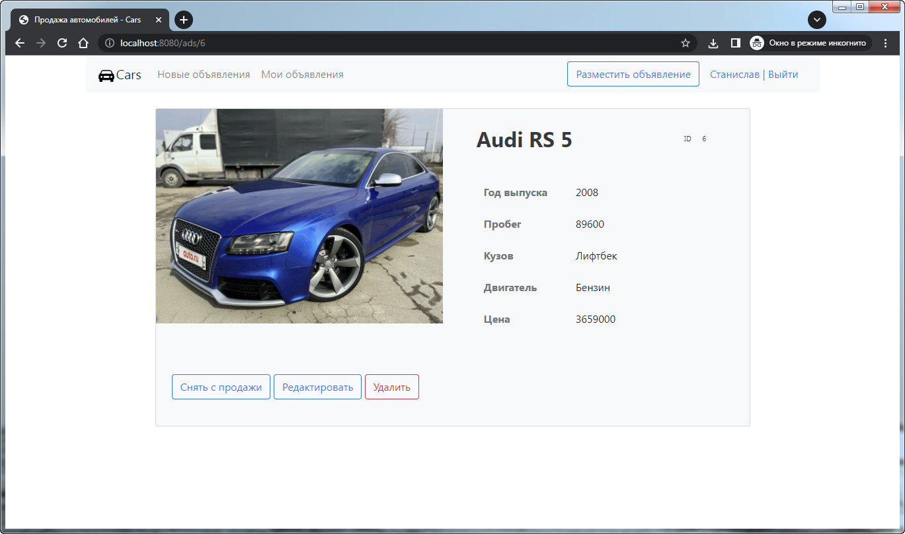

### 10. Свое объявление с проданным автомобилем.

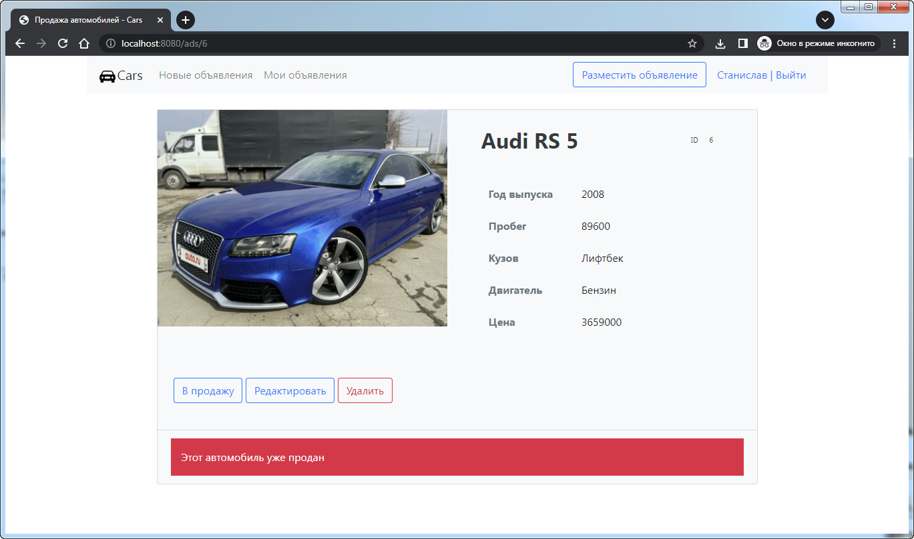

### 11. Редактирование своего объявления. Изменить можно только пробег, цену и фото.

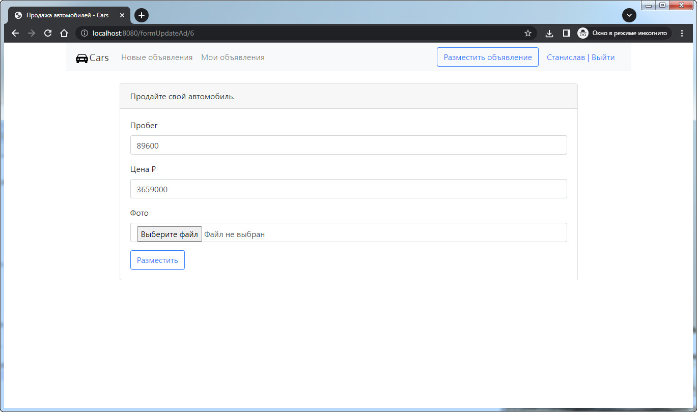